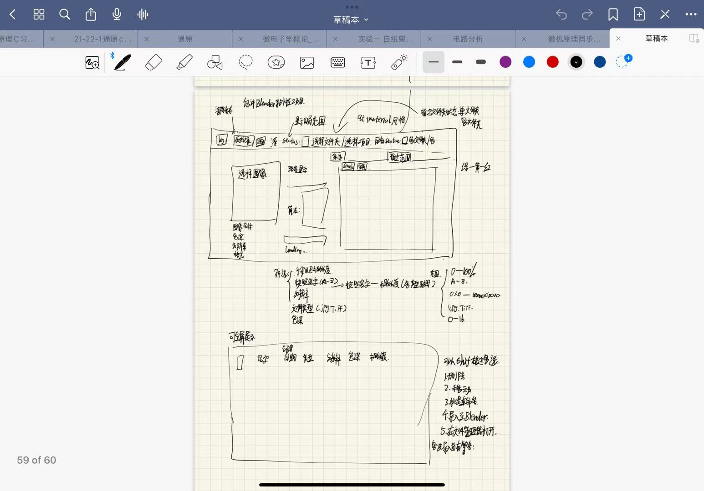
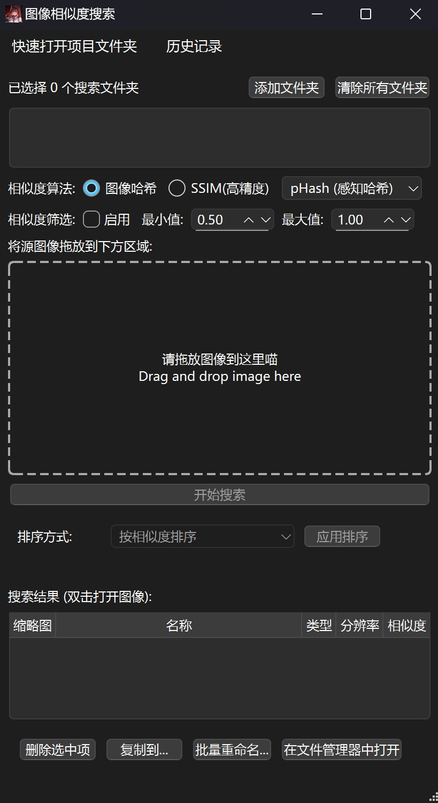
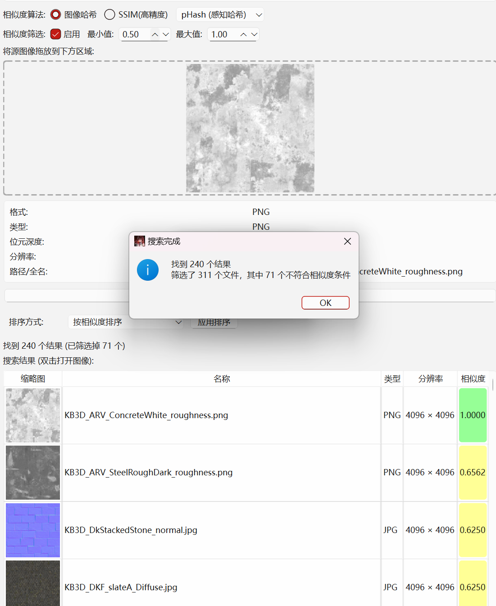
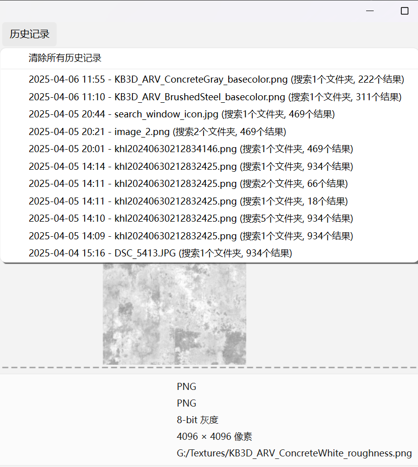
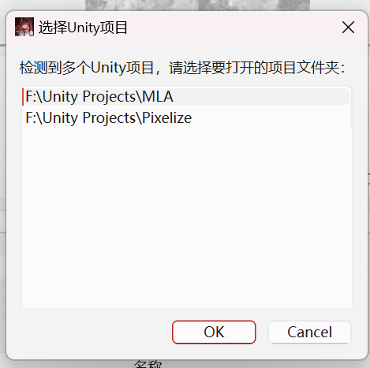
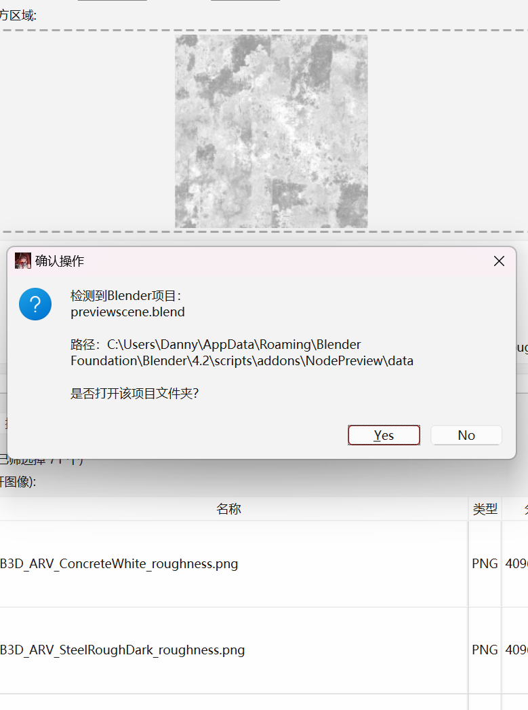
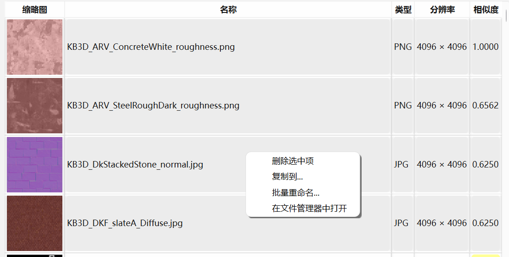
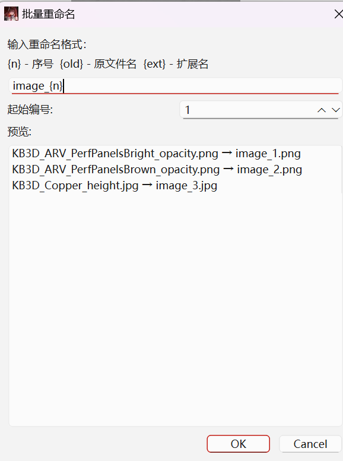
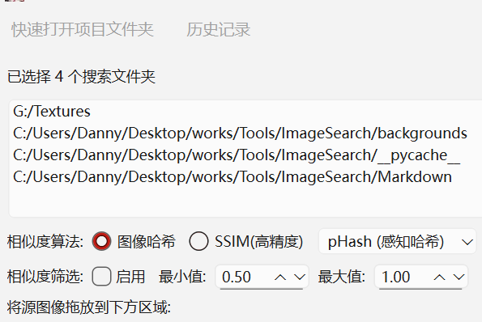

# Search-Image:面向DCC的相似度搜索工具

本项目是一个基于 Python 的图片相似度搜索工具，它支持通过多种图像哈希和 SSIM 算法对大量图像进行相似度判断，并通过直观的图形界面展示搜索结果。同时，项目结合了多进程处理、DCC 软件（如 Unity 和 Blender）检测，快速选择项目文件夹，以及搜索历史管理。为寻找相似图像提供高效、便捷的图像搜索体验。
**安装前置条件**
`pip install Pillow imagehash numpy psutil qtpy PyQt5`
  

---

## 主要特性

 **图形化界面**  
  前端可视化使用 QtPy 框架实现。支持拖拽图片、文件夹选择、右键操作以及进度显示，可以设置搜索条件和查看结果，并允许多类型的排序（首字母、相似度、图片尺寸、图片类型）和列表内多选快速操作。  

 **多种相似度算法**  
  - **图像哈希算法**：使用 [imagehash](https://pypi.org/project/ImageHash/) 库实现感知哈希（pHash）、平均哈希（aHash）和差异哈希（dHash），快速判断图像之间的相似性。  
  - **SSIM 算法**：基于结构相似性指数（SSIM）计算图像间的相似度，实现高精度比对。

**多进程并行处理**  
  使用 multiprocessing 模块，将图像相似度计算任务创建分发给多个子进程。通过合理的批次任务（chunksize）和异步任务提交来分配并充分利用多核 CPU，加快大量图像处理的速度，并实时更新进度条，保持 GUI 响应，支持中途取消。

 **多文件添加与历史记录管理**  
  - 支持文件拖拽、图像预览及可视化的**批量多选操作**（复制、删除、批量重命名、在文件管理器中打开）。  
  - 通过 JSON 文件存储搜索历史，方便用户快速恢复之前的搜索配置，同时提供清除历史记录的功能。

 **DCC软件检测与集成**  
  利用 psutil检测系统中运行的 Unity 和 Blender 进程，自动识别对应的项目路径，允许一次检测多个运行中项目，并可以快速跳转至相关项目文件夹并添加至文件搜索。

---

## 技术栈

 **Python**  
  项目核心使用 Python 语言开发，充分利用其强大的标准库和第三方模块进行图像处理、系统交互以及多进程并行计算。

 **GUI 框架：Qt / qtpy**  
  使用 Qt 框架来构建用户界面，通过 qtpy实现美观的可视化界面。

 **图像处理：Pillow (PIL)**  
  使用 Pillow 库实现图像加载、格式转换、分辨率获取及缩略图生成，并且允许多位色深转换为统一的8bit进行相似度比较。同时结合 imagehash 进行图像哈希计算。

 **不利用库实现的算法：基于NumPy的SSIM算法**  
  主要用于实现 `SSIM` 算法，`SSIM`算法是论文做相似度检测的常用算法，以亮度、对比度、结构信息作为比较数据，对图像像素数据的数学运算并得出由[-1,1]的相似度值。这里为了减轻计算复杂度使用了简化版的实现，并没有使用分块滑动窗口计算，而是直接计算全局的均值和协方差。

 **多进程：multiprocessing**  
  通过 `multiprocessing` 多进程创建进程池，使用 `map_async` 异步提交任务，实现大批量图像相似度计算的并行执行。

 **系统与进程检测：psutil**  
  检测当前运行的 `Unity` 和 `Blender` 进程，提取命令行参数，获取应用程序的项目路径并支持快速打开对应项目文件夹。

 **数据持久化：JSON**  
  利用 JSON 文件保存搜索历史记录，存储上一次搜索时的配置和结果统计，支持历史记录的加载及恢复。

---

## 模块说明

 **Main**  
  主程序文件，包含完整的 GUI 界面逻辑，用户操作、拖放、文件菜单、搜索结果显示等均在此文件中实现，并对其它模块进行调用。

 **DCCdetect**  
  专门用于检测 `DCC` 软件（如 Unity 和 Blender）的模块，借助 psutil 获取运行进程信息并提取项目路径，实现与外部软件的集成。

 **ssim_calculator**  
  自行实现的基于Numpy进行的 `SSIM（结构相似性）`计算核心算法，通过 `PIL` 加载图像并利用 `NumPy` 进行像素数据处理，以获得两个图像的 `SSIM 相似度`。

 **image_processor**  
  包含基于图像哈希和 SSIM 的图像处理函数，对单个图像进行相似度计算，提取图像基本信息，并对结果进行筛选与返回。  
  - `process_image_ssim` 用于 SSIM 相似度计算  
  - `compute_image_hash` 用于多种图像哈希的预计算（感知哈希、平均哈希、差异哈希）

 **search_history**  
  实现搜索历史记录的添加、保存、加载和恢复，在 GUI 历史记录菜单中展示上一次的搜索配置与结果统计，并支持快速恢复上一次的搜索状态。

---

## 设计思路

对于技术栈，我第一想到的是`Python`。如果面向DCC软件进行搜索的话，Python作为丰富的生态库和支持（Blender、Maya等都可以直接支持Python模块和脚本编写）。无疑是在适配方面最好的选择。GUI使用Qtpy，算法实现则可以直接基于numPy。
面向DCC则需要考虑可视化和易用化优先。因此以我的使用经历，我认为一个图片搜索软件应该有**大量的可视化功能**。除了基本的功能实现，还要有：
- 多个文件夹搜索
- 可以Shift右键，可视化并进行重命名、删除、复制等操作
- 可以快速打开项目文件夹（Unity和Blender为例）
- 可以保存历史记录并随时进行查阅和重新调整阈值搜索

算法我选择使用哈希和SSIM。SSIM是我在论文中会使用的算法，我认为在评价图片相似度方面同样可以使用。虽然作为逐像素计算算法，其算法复杂度远远高于哈希计算（尽管分配多进程耗时仍然大约为哈希计算的2-3倍），但是SSIM可以解释，并且由亮度、对比度和结构相似度进行综合加权，这个算法同样可以调整权重扩展到对于**结构相似但是色彩不相似的图片（法线和BaseColor）的识别实现**（虽然还没有完成）

---

## 测试环境&如何执行

使用R5-7500f处理器作为基准，Texture选择使用来自Kitbash项目文件的多张噪声图、Basemap、Normal和HeightMap图。尺寸统一为4096px 4096px，合共302张。可以被批量重命名。执行该程序直接使用控制台执行Main.py即可。

**执行结果**
对于300张合计3.2G图片集，多进程计算哈希值耗时大约为`8s`；多进程SSIM计算约为`25s`；合计写入历史记录并排序，生成图像缓存等，总耗时约为`45s`。

---

## 目前希望实现但是还没有实现的：

### 创建背景图像&毛玻璃效果
目前使用的是qt中的QSS进行背景图设置并切换成毛玻璃效果。但是目前的QSS似乎无法完成一整张图像背景的绘制。毛玻璃效果的话直接套用高斯模糊算法或者使用Photoshop预处理。目前想到的的替代办法`是paintEvent`。

### 添加对DCC的检测与集成
目前的检测方案是使用`psutil`检测当前运行的Unity和Blender进程，提取命令行参数，获取应用程序的项目路径并支持快速打开对应项目文件夹。我希望还可以添加更多的支持，maya或者3dsmax。选用Python完成该项目的一大原因就是现代DCC软件对于Python脚本基本都有很完善的支持。

### 直接在Blender中添加项目的所有索引搜索
目前的可行方案就是编写一个Blender插件，使用`bpy`获取项目中的所有图像所在的文件夹索引并输出到`.json`格式，输出到项目目录，在菜单部分添加对Blender的输出`json`支持，可以直接append到文件夹的列表。
但是还有个更加优雅的办法就是由Claude发起的`MCP`服务器协议，有人为[blender提供了MCP接口支持](https://github.com/ahujasid/blender-mcp)。这个插件可以在项目中构建MCP服务器并且可以实时获取项目中的文件数据，并且可以实时使用`json`进行与blender外的程序沟通。如果开发的话我希望可以接入`MCP`协议，只要连接到Blender的`MCP`就可以实时获取到内部数据，这样可以绕过手动选择图像搜索程序的路径，实现更加无缝的搜索交互。

### 对于多噪声扰乱和高度结构相似图像(BaseMap,NormalMap,HeightMap之间的相似度)的更高级SSIM处理

#### **SSIM的完整公式**：

$$
\text{SSIM}(x, y) = \frac{(2\mu_x \mu_y + C_1)(2\sigma_{xy} + C_2)}{(\mu_x^2 + \mu_y^2 + C_1)(\sigma_x^2 + \sigma_y^2 + C_2)}
$$

#### **简化版公式（本项目使用优化版的）**：
通常将 \(C_1\) 和 \(C_2\) 合并为两个常数项，简化为：
$$
\text{SSIM}(x, y) = \frac{(2\mu_x \mu_y + C_1)(2\sigma_{xy} + C_2)}{(\mu_x^2 + \mu_y^2 + C_1)(\sigma_x^2 + \sigma_y^2 + C_2)}
$$

- 对于多噪声生成的图像，SSIM可以从亮度、对比度、结构信息有效评判相似度，这是传统哈希难以实现的。对于BaseMap、NormalMap和HeightMap之间的相似度，我希望能**提高结构信息的权重对比度，先用Sobel算子进行图像的边缘提取（或者使用Controlnet中的Canny边缘检测），目的是对图像进行边缘检测或梯度计算，然后使用提高结构信息权重的SSIM算法进行相似度计算**。但是这要求使用完整版的SSIM检测（权重调整可以由C1、C2进行间接控制，也就是说不能简单合并C1和C2）。

### 算法优化和添加缓存

batch_size是否实现到最高效的计算仍然有待优化。另外缺少图像缓存，和结果缓存，在生成的时候可能会出现卡顿，如果添加缓存区功能则可以有效减少同文件夹搜索的耗时。

---
## 效果展示

---

## 辅助编程工具

使用Claude进行辅助功能修复和计算优化。

---
